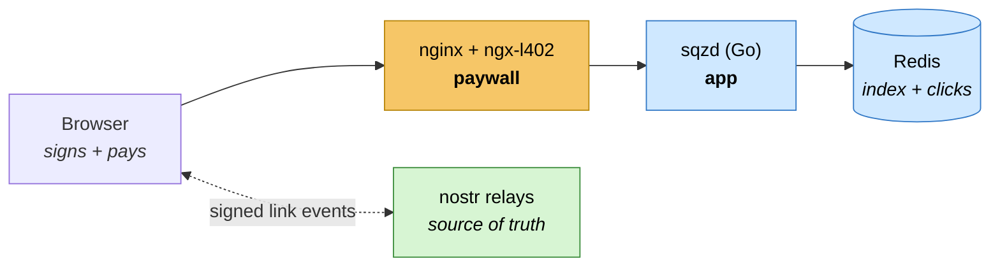

<div align="center">
  
  <p><strong>A URL shortener where you own your links.</strong><br>
  Nostr for identity, Lightning for payment. No accounts, no passwords.</p>
  <p><a href="https://sqzit.in">sqzit.in</a></p>
</div>

---

Most URL shorteners are a database row that belongs to *them*. If the service
disappears, so do your links. sqz works the other way around: a short link is a
message **you** sign with your own key and publish to public relays. sqz indexes
it and redirects fast — but it can't forge one, and it can't make yours vanish.

```
sqzit.in/npub1abc123/launch     works for any nostr user, zero registration
sqzit.in/@ritik/launch          with a NIP-05 name registered at sqz
```

## Why it's built this way

**Your key is your account.** You authenticate by signing each request with your
nostr key ([NIP-98](https://github.com/nostr-protocol/nips/blob/master/98.md)).
There's nothing to sign up for and no password to leak. The key never leaves
your browser.

**Your links are portable.** Each one is a signed
[kind 30078](https://github.com/nostr-protocol/nips/blob/master/78.md) event
living on public relays. Edit it, revoke it, or point a different service at it —
sqz is a reader, not an owner.

**Nobody arbitrates slugs.** Relays already keep one event per
`(kind, pubkey, d)`, so your `launch` and my `launch` are different links by
construction. sqz never has to decide who "gets" a name.

**Paid in sats**, over Lightning, via the
[ngx-l402](https://github.com/DhananjayPurohit/ngx_l402) nginx module. 100 sats
per link, or 500 to choose the name yourself.

### So what am I actually paying for?

Anyone can publish a link event for free. That's the design, not a hole.
**Payment buys indexing, resolution, and the short name — not storage.** An
unpaid link is a perfectly valid event that simply nobody resolves.

## How it works



Payment lives entirely in nginx configuration — `sqzd` has no concept of an
invoice or a satoshi. nginx either passes a request through or answers `402`
itself. Redirects read only from Redis, never from a relay, so relay latency
can't touch the hot path.

📐 **[Full architecture walkthrough →](docs/architecture.md)** — request
sequences, the trust model, the Redis keyspace split, and the
`Authorization`-header collision between NIP-98 and L402.

## Running it locally

> **You must supply a real Lightning address.** The L402 module fetches
> `https://<domain>/.well-known/lnurlp/<name>` at startup and crash-loops nginx
> if it doesn't resolve. This happens even with `l402_dry_run on`, and even if
> no route is paywalled — `LN_CLIENT_TYPE=LNURL` alone triggers it.

```bash
git clone https://github.com/Rits1272/sqz.git
cd sqz

cp .env.example .env
# set LNURL_ADDRESS to an address you own, then generate a signing key:
echo "ROOT_KEY=$(openssl rand -hex 32)" >> .env

docker compose up -d --build
curl http://localhost:8000/health
```

Open <http://localhost:8000>. You'll need a NIP-07 extension such as
[Alby](https://getalby.com) to sign — or use the built-in local key if you
don't have one.

A few things that will bite you otherwise:

- **`l402_dry_run on` is the default** in `nginx/nginx.conf` and **bypasses
  payment**, so you can develop without a wallet. It must be **off** in
  production or the paywall is decorative.
- **The module image is amd64-only**, so it runs under emulation on Apple
  Silicon. `platform: linux/amd64` is pinned in compose.
- **Prices are in millisatoshis.** `l402_amount_msat_default 100000` is 100 sats.
- **`nginx.conf` is bind-mounted as a single file.** Editing it needs
  `docker compose up -d --force-recreate nginx`, or you'll keep serving the old
  config.

## Tests

```bash
go test ./...                                   # unit tests

docker run -d -p 6399:6379 redis:7-alpine       # integration tests need Redis
SQZ_TEST_REDIS_URL=redis://localhost:6399/0 go test ./...
```

Integration tests run against a real Redis rather than a fake, because the
behaviours worth testing — `SETNX` atomicity in the replay guard, TTL-driven
expiry, prefix-scoped rebuild — are Redis semantics, not ours.

## Layout

```
cmd/sqzd/          entrypoint — config, wiring, graceful shutdown
internal/links/    link event parsing + destination validation  ← security-critical
internal/nip98/    NIP-98 verification and replay protection
internal/server/   HTTP routes
internal/store/    Redis layer (derived vs. local keyspaces)
web/               frontend, embedded into the binary via go:embed
nginx/             L402 paywall configuration
brand/             mark and lockup
variants/          design exploration — not shipped
docs/              architecture and payment write-ups
```

## Deployment

sqz ships as a single compose stack and expects to sit behind a TLS-terminating
proxy. Everything environment-specific lives in `.env` (see `.env.example`) —
nothing about a particular host is committed to this repo.

```bash
cd /path/to/sqz && docker compose -p sqz up -d --build
```

The `-p sqz` project name keeps its containers, network, and volume isolated
from anything else on the box.

Configure at minimum:

| Variable | Why it matters |
|---|---|
| `SQZ_BASE_URL` | NIP-98 signatures bind to the absolute URL. A mismatch silently fails **every** signature. |
| `SQZ_HOST` | Canonical domain for proxy routing. Must match the host in `SQZ_BASE_URL`. |
| `SQZ_PORT` | Move it if the default host port is taken. |
| `LNURL_ADDRESS` | Where payments land. Must be an address **you** own. |
| `ROOT_KEY` | Signs L402 macaroons. Generate fresh per deployment. |
| `SQZ_ADMIN_TOKEN` | Guards `/admin/rebuild`. Unset disables the endpoint entirely. |

### Before charging real sats

1. **Set `LNURL_ADDRESS` to an address you own.** Otherwise payments route to
   whoever the placeholder belongs to.
2. **Set `l402_dry_run off`** in `nginx/nginx.conf`. While it's on, every
   paywalled route passes through unpaid.
3. **Serve over TLS.** Signing needs a secure context, and `SQZ_BASE_URL` must
   change to `https://` at the same time.
4. **Back up Redis.** Click analytics and short-npub assignments exist nowhere
   else — see the [keyspace split](docs/architecture.md#5-redis-holds-two-very-different-things).

## Status

**Working:** NIP-98 auth with replay protection, link validation, redirect path,
link listing, NIP-05 registry, L402 gating with real invoices, token-gated admin
rebuild, and the web frontend (NIP-07 signing, create/revoke, inline WebLN
payment with QR fallback).

**Not built yet — the relay reconciler.** Links are indexed only when submitted,
and `/admin/rebuild` clears without replaying. So "relays are the source of
truth" is the design and a property of the data, but not yet something sqz
demonstrates by rebuilding itself. Also pending: paid NIP-05 name registration
and the analytics read API.

## Brand

Two jaws closing **laterally** on a link — lateral because a URL is a horizontal
string, and shortening reduces its width. Both `brand/mark.svg` and
`brand/lockup.svg` use `currentColor`, so they inherit whichever theme they land
in. See [`brand/README.md`](brand/README.md) for sizes and clear space.
