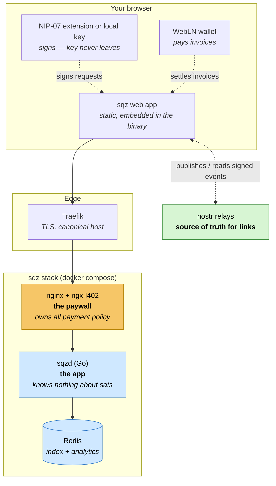
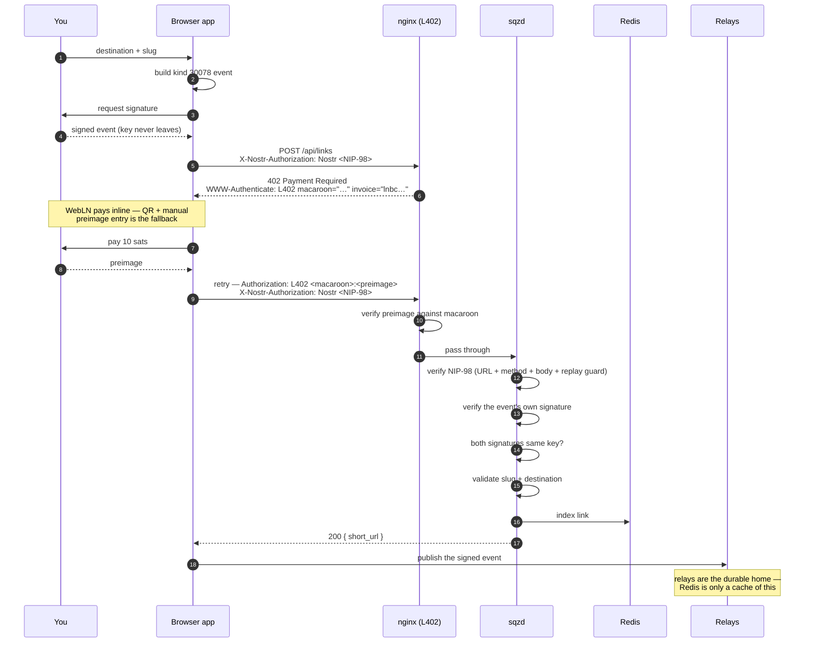
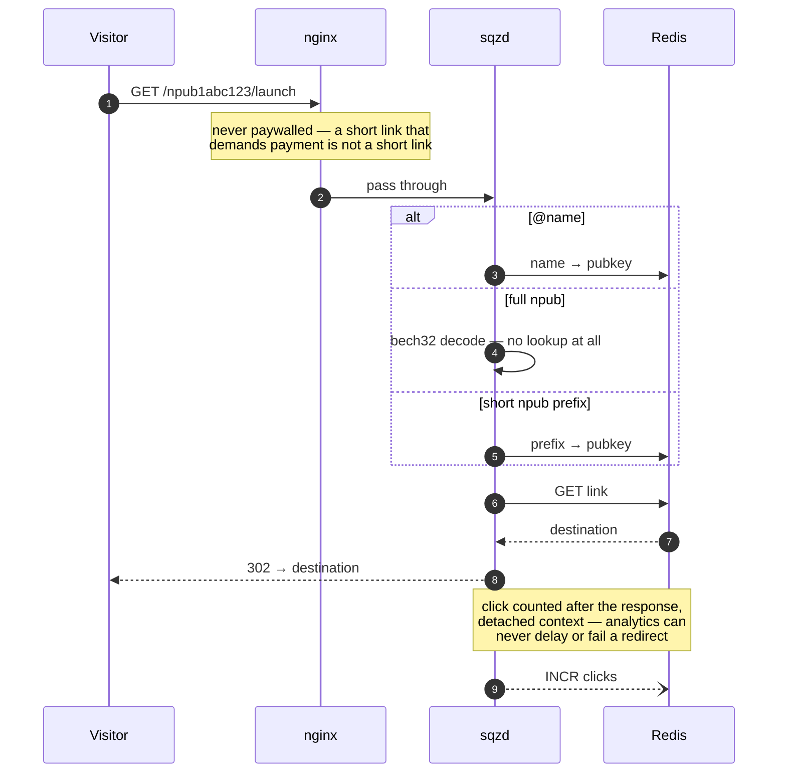
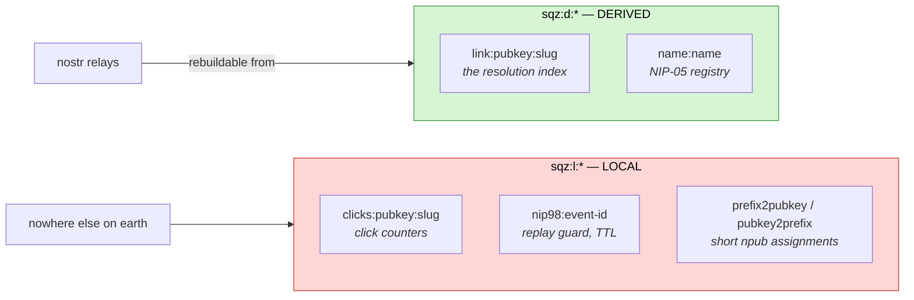
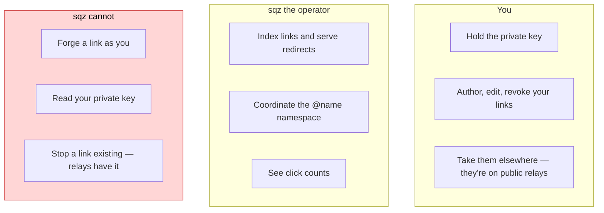
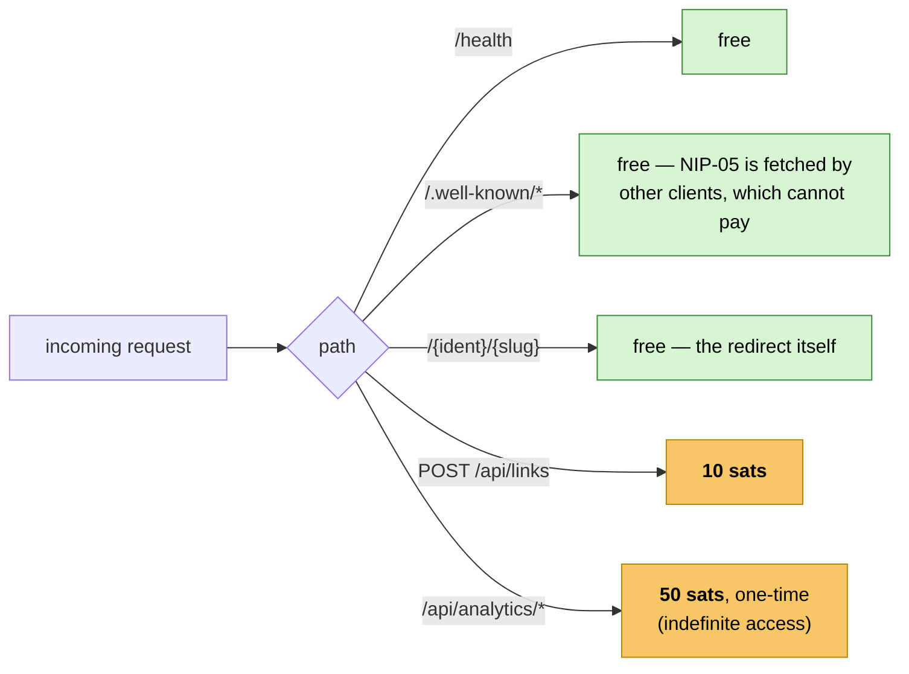

# How sqz works

sqz is a URL shortener where **you own your links**. There is no account, no
password, and no row in a database that belongs to sqz. A short link is a
message you sign with your own nostr key and publish to public relays. sqz's job
is narrow: index those messages, hand out a short name, and redirect fast.

This document explains the pieces and how a request moves through them.

---

## 1. The shape of the system

Three processes and one external network. Nothing else.



**The one structural decision worth understanding:** payment lives entirely in
nginx configuration, not in Go code. `sqzd` has no concept of an invoice, a
macaroon, or a satoshi. nginx either passes a request through or answers `402`
itself. That means pricing changes are config edits, and there is no code path
where a payment bug can corrupt a link.

| Component | Responsibility | Deliberately does *not* |
|---|---|---|
| **nginx + ngx-l402** | Issue Lightning invoices, verify preimages, gate paid routes | Know what a link is |
| **sqzd** | Verify signatures, validate links, resolve redirects, serve NIP-05 | Know what a payment is |
| **Redis** | Fast index for resolution + click counts | Be authoritative for links |
| **nostr relays** | Durably store the signed link events | Be on the redirect hot path |

---

## 2. What a short link actually *is*

Not a database row. A signed [NIP-78](https://github.com/nostr-protocol/nips/blob/master/78.md)
event (kind `30078`) that **you** author:

```jsonc
{
  "kind": 30078,
  "pubkey": "<your public key>",
  "tags": [
    ["d",     "sqz:launch"],            // the slug, namespaced to sqz
    ["r",     "https://example.com/…"], // the destination
    ["title", "Launch post"],           // optional
    ["expiration", "1767225600"]        // optional, NIP-40
  ],
  "sig": "<your signature>"
}
```

Two properties fall out of this for free:

- **Relays keep only the newest event per `(kind, pubkey, d)`.** That gives slug
  uniqueness *per identity* without sqz arbitrating anything. Your `launch` and
  my `launch` are different links and always were.
- **Revocation needs no cooperation.** Republish the event with an empty `r`
  tag. Many relays ignore NIP-09 deletions, so sqz treats "no destination" as an
  explicit, meaningful state rather than a parse error.

The only globally unique namespace in the whole system is **names** (`@ritik`),
which is precisely the one thing sqz coordinates — via Redis `SETNX`, so two
concurrent claims can never both win.

### So what am I paying for?

Anyone can publish a link event for free. That's the design, not a hole.
**Payment buys indexing, resolution, and the short name — not storage.** An
unpaid link is a perfectly valid event that simply nobody resolves.

---

## 3. Creating a link

This is the interesting path, because two independent challenges have to be
satisfied at once: *who are you* and *did you pay*.



### The header collision, and why there are two of them

NIP-98 says to put the identity credential in `Authorization`. So does L402.
On a paid route they fight: the L402 module sees `Authorization: Nostr …`,
decides it is a malformed L402 credential, and returns `401` *before* the
payment handshake can even begin.

The fix is to move identity to a dedicated header, `X-Nostr-Authorization`, and
leave `Authorization` to L402. sqzd prefers the dedicated header and falls back
to `Authorization` for unpaid routes and older clients — the fallback can never
misread an L402 value, because on a paid route the dedicated header is always
present and wins. Full write-up in [payments.md](payments.md).

### Four checks, each closing a specific hole

| Check | What breaks without it |
|---|---|
| NIP-98 signature covers URL + method + body hash | A captured header could be replayed against a different endpoint |
| Replay guard (`SETNX` with TTL, atomic) | The same signed header works twice |
| The link event's own signature | sqz indexes data no relay would ever accept |
| **Event pubkey == authenticated pubkey** | Anyone could submit *your* link event and seize your slug |

---

## 4. Following a link — the hot path

Everything above is the slow path, and it only runs when you create something.
A redirect is one Redis read.



Three deliberate choices here:

- **Never reads a relay.** A slow or unreachable relay cannot affect a redirect.
  Redis is the only thing in the path.
- **`302`, not `301`.** Browsers cache a `301` forever, which would make
  destination edits invisible and silently stop counting clicks.
- **Analytics runs detached** with its own timeout, after the response is sent.

### The three identity forms

```
sqzit.in/npub1abc…xyz/launch    full npub — works with zero registration
sqzit.in/npub1abc123/launch     short prefix — auto-assigned, stable forever
sqzit.in/@ritik/launch          NIP-05 name registered at sqz
```

A full npub is 63 characters, which makes the "short" link longer than most
things worth shortening. So sqz assigns a truncated prefix — `npub1` plus 7
characters, ~34 billion combinations — and lengthens it one character at a time
on collision, exactly like git short SHAs. Nobody can claim a prefix for a key
they don't hold, because it is *derived* from the key.

---

## 5. Redis holds two very different things

This is the distinction most likely to cause an outage if it's forgotten, so
it's enforced by key prefix.



| | `sqz:d:*` — derived | `sqz:l:*` — local |
|---|---|---|
| Authoritative? | No — a cache of relay state | **Yes — exists nowhere else** |
| Safe to flush? | Yes, that's what `/admin/rebuild` does | **Never** |
| Needs backups? | No | **Yes** |

Click data is observed server-side, unsigned, and privacy-sensitive, so it can
never be published to a public relay — which is exactly why it has no other home
and must be backed up.

**Why are short-npub prefixes *local* and not derived?** Because assignment is
first-come-first-served. Replaying relays in a different order would hand out
different prefixes, silently rewriting every short URL already in circulation.
They have to survive a rebuild.

---

## 6. Trust model

What can each party do, and what can't it?



The private key never reaches the server. Signing happens in a
[NIP-07](https://github.com/nostr-protocol/nips/blob/master/07.md) browser
extension, or against a key kept in browser storage for people without one.

**Destination validation is the security-critical code** ([`internal/links`](../internal/links/link.go)):
sqz issues a `Location` header pointing at user-supplied data. Only `http` and
`https` are permitted — `javascript:` and `data:` would execute script in the
origin the visitor is sent *from*, and `file:` reads local resources. Slugs are
restricted to `[A-Za-z0-9._-]` so they can't forge extra path structure, and
destinations pointing back at sqz are rejected as redirect loops.

The admin rebuild endpoint fails closed: with no token configured, no request is
ever authorized, and it answers `404` rather than `401` so an unauthenticated
caller learns nothing about whether it exists. An unset credential must never
mean "no credential required" — that turns a missing config value into a public
keyspace-flush button.

---

## 7. Request routing

Which routes cost money, and which must never:



`/.well-known/nostr.json` must stay free and CORS-open: NIP-05 verification is
performed by *other people's* nostr clients, which have no way to pay an
invoice. Paywalling it would break every `@name` link at the point of
verification.

Prices are in **millisatoshis** — `l402_amount_msat_default 10000` is 10 sats.

---

## 8. Current state

**Working:** NIP-98 auth with replay protection, link validation, the redirect
path, link listing, NIP-05 resolution, L402 gating with real invoices,
token-gated admin rebuild, and the web frontend (NIP-07 signing, create/revoke,
inline WebLN payment with QR fallback).

**Not built yet — the relay reconciler.** Links are currently indexed only at
the moment they're submitted, and `/admin/rebuild` clears the derived keyspace
without replaying from relays. So "relays are the source of truth" is accurate
as a design and as a property of the *data*, but sqz does not yet actually
rebuild itself from them. This is the main gap between the architecture as
described and as implemented.

Also pending: paid NIP-05 name registration, and the analytics read API behind
`/api/analytics/`.
